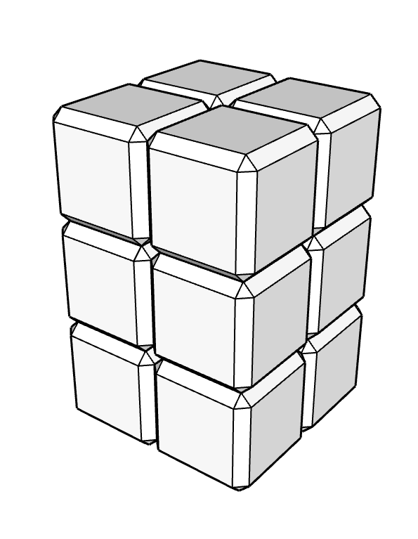

# Les nombres de 0 à 100

## Tables de multiplication visuelles et autres nombres de 0 à 100

### Description
Planches illustrées à afficher à l'école présentant visuellement, en 3D, des tables de multiplication, des nombres carrés, des cubes, des nombres triangulaires et les nombres premiers jusqu'à 100.

### English : A 3D visual representation of numbers from 0 to 100 to aid learning times tables at school.

### Téléchargement
- [nombres.pdf](nombres.pdf)
- [nombres.odg (LibreOffice)](nombres.odg)

### Observation
Beaucoup d'enfants ont des difficultés à apprendre les tables de multiplication.

### Apport des sciences cognitives
Apprendre consiste à créer des associations pertinentes entre informations déjà connues et nouvelles. Comprendre et apprendre sont liés : il est difficile d'apprendre ce qu'on ne comprend pas.

### Hypothèses
- Lire une table et la répéter oralement ne mobilise pas assez de structures cognitives existantes et pertinentes pour créer des associations sémentiques stables pour fixer l'information en mémoire.
- Les élèves ayant de bonnes facultés visuelles et spatiales ne les exploitent pas assez pour apprendre les tables de multiplication.

### Intention
Fournir des entrées visuelles et spatiales aux élèves pour qui la méthode récitative de l'apprentissage des tables ne réussit pas.

### Analyse 
La structures des nombres composés repose sur :
- la décomposition en facteurs premiers,
- la commutativité,
- l'associativité,
concepts qui sans être abordés explicitement à ces ages peuvent être exploités pour faciliter le dénombrement visuel et apporter du sens aux nombres composés.

### Conception
L'unité est représentée graphiquement par un cube chanfreiné inspiré des cubes de numération de 1 cm, fréquemment utilisés à l'école pour l'apprentissage du système décimal. Cet objet est déja associé à l'unité pour beaucoup d'élèves.

Les trois axes de l'espace sont exploités pour mettre en valeur les nombres premiers facteurs dans le produit.

`ex : 9x4=36
On présente 9 par un carré de 3x3 sur un plan Oxz et 4 par un carré 2x2 sur le plan Oxy`

Visuellement les décompositions en facteurs premiers des nombres et révèlent l'identité des nombres comme 12x3 et 9x4 et 18x2.

Compléter les tables classiques par tous les nombres de 0 à 100 n'y apparaissant pas, les nombres premiers, les nombres triangulaires. Ces catégories révèlent des structures, une beauté à explorer qui peut motiver les refractaires aux tables à s'intéresser tout de même aux mathématiques.

### Mise en garde
Ce materiel pourrait comporter des erreurs. Les hypthèses pourraient se révéler fausses. l'apport didactique et pédagogique reste à démontrer.
